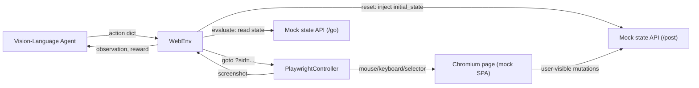

# web_env — A Gymnasium Environment for CUA-Gym-Hub Mock Websites

`web_env` wraps the 98 mock web applications in [`hub/websites/`](../hub/websites)
as a single `gymnasium.Env` subclass, `WebEnv`, for training and evaluating
vision-based computer-use agents. It reuses each mock's existing HTTP state
API (`/post`, `/go`, `/upload`) for deterministic, resettable, per-episode
world state, and drives the browser via Playwright.

## Install

```bash
pip install -e .          # from the repo root; installs the web_env package + deps
playwright install chromium
```

## Quick start

```python
from web_env import WebEnv
from web_env.tasks import Book12306Task

env = WebEnv(url_mode="public", headless=True)   # or url_mode="local", host="<ip>"

obs = env.reset(task_config=Book12306Task())
# obs = {"screenshot": np.ndarray[H,W,3] uint8, "url": str}

# Pixel-coordinate action (vision-model grounded on the screenshot)
obs, reward, terminated, truncated, info = env.step({"type": "click", "x": 640, "y": 380})

# DOM-selector action (when the exact element is known)
obs, reward, terminated, truncated, info = env.step({"type": "click", "selector": "#submit-order"})

score = env.evaluate()          # 0.0-1.0, rubric-based partial credit
frame = env.render("rgb_array")  # same screenshot as obs["screenshot"]

env.close()
```

Or as a context manager:

```python
with WebEnv(url_mode="public") as env:
    env.reset(task_config=Book12306Task())
    ...
```

## Vision agent (Qwen-VL)

A basic OpenAI-compatible vision agent lives in
[`web_env/agents/qwen_vl_agent.py`](agents/qwen_vl_agent.py), adapted from
[OSWorld-V2's `qwen35vl_agent.py`](https://github.com/xlang-ai/OSWorld-V2/blob/main/mm_agents/qwen35vl_agent.py).

Changes vs the desktop agent:

- Prompts describe a **web browser** over mock websites (not a full Ubuntu GUI).
- Tool calls parse into :mod:`web_env.actions` dicts (``click`` / ``type`` /
  ``key`` / ``scroll`` / ``drag`` / ``hover`` / ``wait`` / ``terminate``)
  instead of ``pyautogui`` code strings.
- LLM calls go through the OpenAI Python client against a LiteLLM (or any
  OpenAI-compatible) endpoint configured via ``.env``.

Copy [`.env.example`](../.env.example) → ``.env`` and fill in:

```bash
WEBENV_BASE_URL=http://litellm.tiktok-row.net/v1
WEBENV_API_KEY=sk-1234
WEBENV_MODEL=qwen3_5_yiding
```

Run a rollout:

```bash
python scripts/run_web_agent.py --max-steps 30
# or against a local mock deployment:
python scripts/run_web_agent.py --url-mode local --host 163.7.16.44 --headed
```

Programmatic usage:

```python
from web_env import WebEnv, QwenVLAgent
from web_env.tasks import Book12306Task

env = WebEnv(url_mode="public", headless=True)
agent = QwenVLAgent()  # reads WEBENV_* / OPENAI_* from env
agent.reset()

task = Book12306Task()
obs = env.reset(task_config=task)
for _ in range(30):
    _, actions = agent.predict(task.instruction, obs)
    for action in actions:
        obs, reward, terminated, truncated, info = env.step(action)
        if terminated:
            break
    if terminated:
        break
print("score:", env.evaluate())
env.close()
```

## Architecture



- **Backend**: Playwright drives a single Chromium tab
  ([`controller.py`](controller.py)). The viewport is fixed and
  `device_scale_factor=1`, so pixel coordinates in actions line up exactly
  with the pixels in the returned screenshot.
- **World state**: each mock exposes an identical state API namespaced by a
  per-episode `sid` (see [`hub/README.md`](../hub/README.md) and
  [`.claude/skills/mock_websites/SKILL.md`](../.claude/skills/mock_websites/SKILL.md)).
  `WebEnv.reset()` POSTs the task's `initial_state()` *before* navigating the
  browser there (state must exist before the SPA's first load — injecting
  after load requires a manual refresh).
- **Evaluation**: `WebEnv.evaluate()` GETs `/go?sid=...` (`{initial_state,
  current_state, state_diff}`) and hands it to the task's `evaluate()` for
  rubric-based scoring.

## `WebEnv` API

```python
WebEnv(
    url_mode="public",       # "public" (cua-gym-*.xlang.ai) or "local" (self-hosted)
    host=None,               # local deployment host/IP (url_mode="local" only)
    viewport=(1280, 800),
    headless=True,
    cdp_url=None,             # connect to an existing Chromium via CDP instead of launching
    pause_default=2.0,
    keep_state_on_close=False,
)
```

- `reset(task_config=None, seed=None, options=None) -> dict` — loads a
  `WebTask` (instance, dict, or JSON path), injects its `initial_state()`
  into the target mock under a fresh `sid`, navigates the browser to
  `<base_url>/?sid=<sid>`, and returns the first observation.
  - `reset_gym(...)` is a thin wrapper returning the strict Gymnasium
    `(obs, info)` tuple for infra that expects it.
- `step(action, pause=2) -> (obs, reward, terminated, truncated, info)` —
  validates and executes one action, sleeps `pause` seconds for the SPA to
  settle, and returns the standard Gymnasium 5-tuple. `reward` is `0.0`
  unless `action == {"type": "terminate"}`, in which case it equals
  `evaluate()`.
- `evaluate() -> float` — `0.0-1.0` score from the current task's rubric.
- `render(mode="rgb_array")` — `"rgb_array"` returns the screenshot array;
  `"human"` additionally saves it to a temp PNG and returns the path.
- `close()` — closes the browser/Playwright resources and (by default)
  clears the episode's server-side state (`POST {"action":"reset"}`).

## Action schema (hybrid pixel + DOM)

An action is a plain JSON-serializable dict with a `"type"` field. Targeting
is **either** pixel coordinates (`x`/`y`, matching the screenshot 1:1) **or**
a Playwright selector (`selector`) — whichever the caller/model has
available.

| Type | Fields | Maps to |
|---|---|---|
| `click` | `x,y` or `selector`; `button` (`left`\|`right`\|`middle`) | `mouse.click` / `page.click` |
| `double_click` | `x,y` or `selector` | `mouse.dblclick` / `page.dblclick` |
| `right_click` | `x,y` or `selector` | click with `button="right"` |
| `type` | `text`; optional `selector` | `page.fill(selector, text)` or `keyboard.type(text)` |
| `key` | `keys` (`"Control+A"` or `["Control","a"]`) | `keyboard.press` |
| `scroll` | optional `x,y`; `dx,dy` | `mouse.wheel(dx, dy)` (after moving to `x,y` if given) |
| `drag` | `x,y` or `selector`; `to_x,to_y` | `mouse.move/down/move/up` |
| `hover` | `x,y` or `selector` | `mouse.move` / `page.hover` |
| `goto` | `url` (absolute or relative — relative URLs preserve the current `?sid=`) | `page.goto` |
| `wait` | `ms` (default 1000) | `page.wait_for_timeout` |
| `terminate` | — | signals episode end; `step()` sets `terminated=True` and `reward=evaluate()` |

```python
{"type": "click", "x": 640, "y": 380}
{"type": "click", "selector": "#submit-order"}
{"type": "type", "text": "北京", "selector": "#from-input"}
{"type": "key", "keys": "Control+A"}
{"type": "scroll", "x": 640, "y": 400, "dy": 600}
{"type": "drag", "x": 100, "y": 100, "to_x": 300, "to_y": 400}
{"type": "goto", "url": "/orders"}
{"type": "terminate"}
```

`web_env.actions.validate()` raises `ValueError` for structurally invalid
actions (unknown type, missing required fields). Runtime failures (e.g. a
selector that doesn't match anything) are caught by the controller and
reported in `info["action_result"] = {"ok": False, "error": ...}` instead of
raising, so a rollout can continue after a bad action.

## Writing a `WebTask`

Subclass [`web_env.task.WebTask`](task.py):

```python
from web_env.task import WebTask

class MyTask(WebTask):
    task_id = "my_task"
    mock = "slack_mock"                 # registry key, see web_env/registry.py
    instruction = "Send 'hello' in #general."

    def initial_state(self) -> dict:
        # Consult hub/websites/<mock>/SCHEMA.md for the required top-level keys.
        return {...}

    def evaluate(self, env, go) -> float:
        current = self.current_state(go)
        # award partial credit per sub-goal, e.g.:
        score = 0.0
        if <sub-goal 1>:
            score += 0.5
        if <sub-goal 2>:
            score += 0.5
        return score
```

- **Always** read the target mock's `SCHEMA.md` (`hub/websites/<mock>/SCHEMA.md`)
  before writing `initial_state()` — missing required top-level keys causes a
  blank or crashing UI.
- Override `setup(self, env)` for extra steps beyond a single state
  injection: file uploads (`env.state_client.upload(...)`), or injecting
  state into `related_apps` for multi-mock tasks (use `env.base_url_for(name)`
  and `env.sid` for each additional mock, per
  [`.claude/skills/mock_websites/SKILL.md`](../.claude/skills/mock_websites/SKILL.md) §6).
- `evaluate()` receives the live `/go` response
  (`{initial_state, current_state, state_diff}`) — score against
  `current_state`, using `initial_state`/`state_diff` to distinguish
  agent-made changes from pre-seeded data (see
  [`web_env/tasks/task_12306_book_pay.py`](tasks/task_12306_book_pay.py) for
  a worked example with 2-step partial credit).

## Registry

[`web_env/registry.py`](registry.py) maps all 98 mock directory names to
their local deployment port (`hub/deploy-all.sh` / `DEPLOY.md` convention)
and public URL slug:

```python
from web_env.registry import base_url, all_mocks

base_url("slack_mock", mode="public")            # -> "https://cua-gym-slack.xlang.ai"
base_url("12306_mock", mode="local")             # -> "http://163.7.16.44:8000"
base_url("12306_mock", mode="local", host="10.0.0.5", port=9000)
all_mocks()                                       # -> sorted list of all 98 mock names
```

If a self-hosted deployment uses different ports/hosts than the defaults,
pass `host=` (and optionally per-call `port=`) rather than editing the
registry.

## Notes / limitations

- The Playwright backend is the only supported controller today; a VM +
  pyautogui backend (à la [`utils/env.py`](../utils/env.py)) could be added
  later behind the same `execute()`/`screenshot()`/`goto()`/`close()`
  interface used by `PlaywrightController`.
- Only [`web_env/tasks/task_12306_book_pay.py`](tasks/task_12306_book_pay.py)
  is provided as a worked example; write additional `WebTask` subclasses per
  mock/task following the same pattern.
- `WebEnv` does not enforce a step limit — `truncated` is always `False`;
  wrap with a Gymnasium `TimeLimit`-style wrapper if needed.
